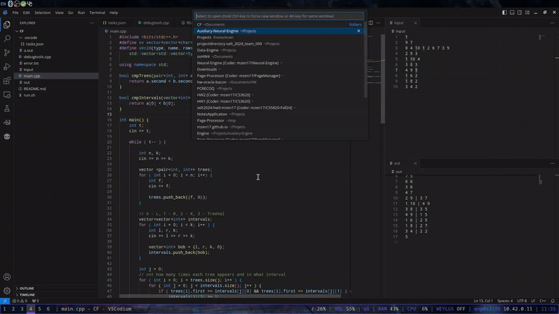

# Usage

## Setup
1. git clone `https://github.com/mzen17/CP-VSCode.git`
2. VSCode -> Open folder CP-VSCode

## Steps
1. Write into the input file
2. Write code into the main.cpp file
3. Ctrl+Shift+B (VSCode Build), or `./run.sh`
4. See out file get populated.
